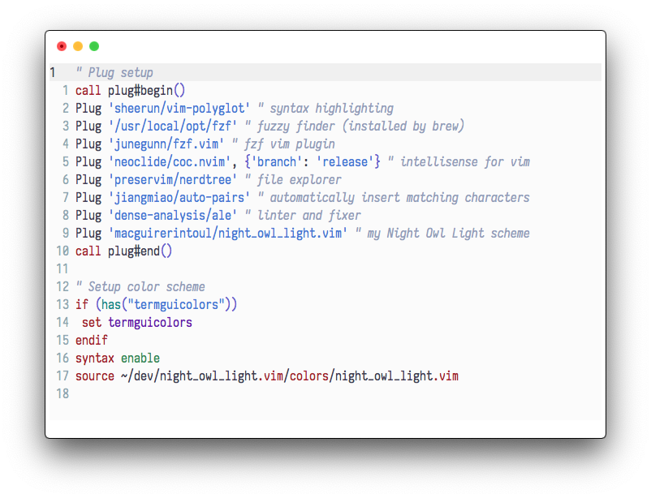

# night_owl_light.vim

> A light colour scheme for Vim based on [@sdras](https://github.com/sdras/)' Light Owl (aka Night Owl Light) [VSCode theme](https://github.com/sdras/night-owl-vscode-theme).


*Font is [Iosevka](https://github.com/be5invis/Iosevka)*

## Installation
### Package manager
```
" vim-plug
Plug 'macguirerintoul/night_owl_light.vim'
" NeoBundle
NeoBundle 'macguirerintoul/night_owl_light.vim'
" Vundle
Plugin 'macguirerintoul/night_owl_light.vim'

if (has("termguicolors"))
 set termguicolors
endif

syntax enable
colorscheme night_owl_light
```

### Manual
1. Download `./colors/night_owl_light.vim`
2. Put it in `~/.vim/colors`